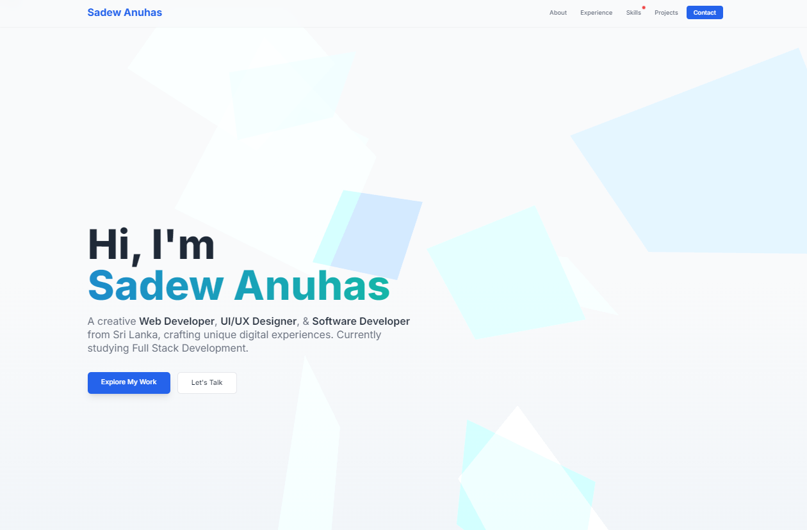

# Sadew Anuhas - Personal Portfolio Website

 This repository contains the source code for the personal portfolio website of Sadew Anuhas, showcasing skills in web development, UI/UX design, software development, graphic design, and video editing.

**Live Demo:** [**sadew.online**](https://sadew-anuhas.github.io/sadew.online-demo/)

## Description

A modern, responsive, single-page portfolio website built to highlight Sadew Anuhas's diverse skillset and projects. It features interactive elements, animations, and a clean light theme, designed to provide an engaging user experience for potential clients or employers.

## Features

* **Responsive Design:** Adapts seamlessly to various screen sizes (desktop, tablet, mobile).
* **Light Theme:** Clean and modern user interface with a light color palette.
* **Interactive Background:** Dynamic background animation using Three.js (Cloud style).
* **Interactive Sketch:** p5.js sketch that reacts to mouse interaction (in About section).
* **Smooth Scrolling & Navigation:** Fixed header with scrollspy highlighting active section.
* **Content Sections:**
    * Hero Section (Gradient Text, Animated Intro)
    * About Me (Updated Bio, Image)
    * Services Offered
    * Skills (Categorized)
    * My Process/Approach
    * Experience (Timeline Format)
    * Projects (Filterable Grid)
    * Testimonials
    * Contact Form (Redesigned Inputs)
* **Animations:** Subtle scroll reveal animations, hover effects, preloader animation (pulsing dots).
* **SEO Optimized:** Basic meta tags for search engine visibility.

## Technologies Used

* **Frontend:** HTML5, CSS3, JavaScript (ES6+)
* **Styling:** Tailwind CSS (v3 via CDN)
* **Animations/Graphics:**
    * Three.js (r128 via CDN) - For background animation
    * p5.js (v1.9.3 via CDN) - For interactive sketch
    * CSS Animations & Transitions
* **Icons:** Font Awesome (v6 via CDN)
* **Fonts:** Google Fonts (Inter)

## Setup (For Static Version - `index.html`)

1.  **Clone/Download:** Get the project files (`index.html`, `style.css`, `script.js`, `three-bg.js`, `p5-sketch.js`, `assets/`).
2.  **Assets:** Ensure the `assets` folder contains your `me.png` photo and any other necessary images.
3.  **Open `index.html`:** Open the `index.html` file directly in your web browser.

*(If using the Flask version locally, follow Python environment setup and run `python app.py`)*

## Customization

1.  **Content:** Edit `index.html` directly to change text content in sections like About, Experience, Services, Process, Testimonials. Replace all placeholder content marked with `[...]`.
2.  **Contact Form:** Update the `mailto:` link in the Contact section and potentially configure a backend service (like Formspree or Netlify Forms) or use the provided Flask backend logic for the contact form to work.
3.  **Projects:** Update project details (titles, descriptions, tags, links) within the Projects section HTML or the data source used by your filtering logic if modified.
4.  **Styling:**
    * Modify the Tailwind configuration script in `index.html` (`tailwind.config = {...}`) to change colors, fonts, etc.
    * Add custom CSS overrides or new styles to `style.css`.
5.  **Animations:** Adjust Three.js (`three-bg.js`) or p5.js (`p5-sketch.js`) parameters for different visual effects. Modify CSS animations/transitions in `style.css`.

## Author

* **Sadew Anuhas**
    * [GitHub](https://github.com/Sadew-Anuhas/)
    * [X ](https://x.com/sadewofficial/)
    * [Portfolio](https://sadew-anuhas.github.io/sadew.online-demo/)

## License

This project is licensed under the MIT License - see the [LICENSE.md](LICENSE.md) file for details (Optional: Create a LICENSE.md file with the MIT license text).
